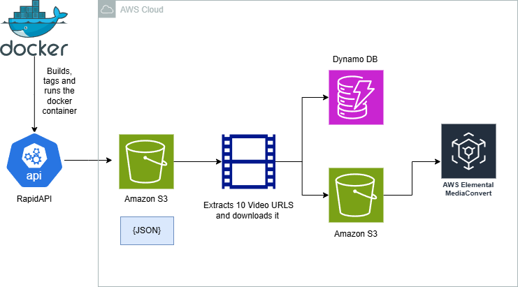

  
  
## ☁️ MultiCloud, DevOps & AI Challenge — Day 5 — Implementing analytics integration and deploying E-commerce Cloudmart to Production ☁️

This is part of the final project of the Multicloud, Devops and AI Challenge!

In this project I focused on implementing analytics integrations and deploying CloudMart to production through seamless update and usage of Multicloud (AWS, Google Cloud and Azure). The process encompassed code updates, analytics configuration, and deployment automation.

<h2>Environments and Technologies Used</h2>

  - Amazon Web Services (AWS)
  - 

  
  
<h2>Key Features</h2>  

✅ 
✅ 
✅ 

<h2>Step by Step Instructions</h2>

***1. Create a BigQuery with Google Cloud***

***2.  Creating Resources using Terraform***

***3. Set up Azure Text Analytics ***

***4. Deploy Cloudmart backend and update Kubernetes - Final Result***

In this final step, we will create our `cloudmart-backend.yaml` file to execute the deployment:

<h2>Conclusion</h2>

The successful completion of these integrations and deployments established CloudMart as a production-ready platform with robust analytics capabilities and scalable infrastructure.
